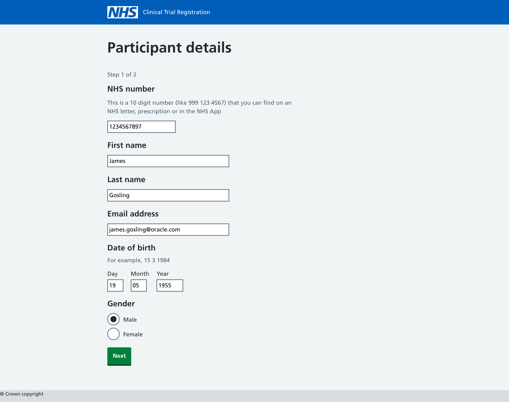
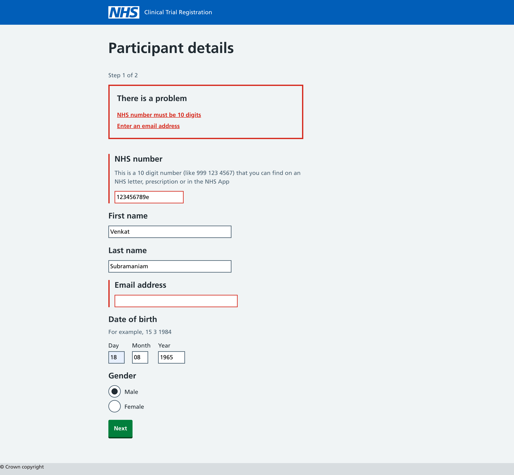
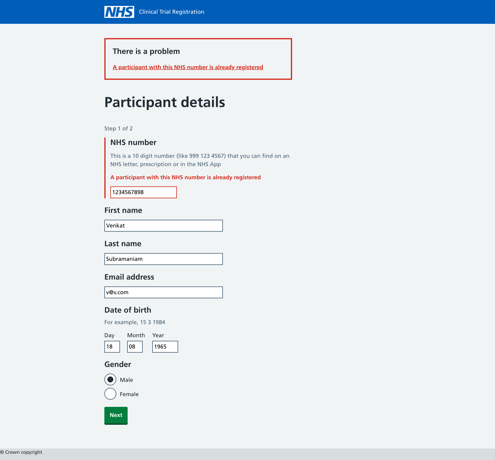
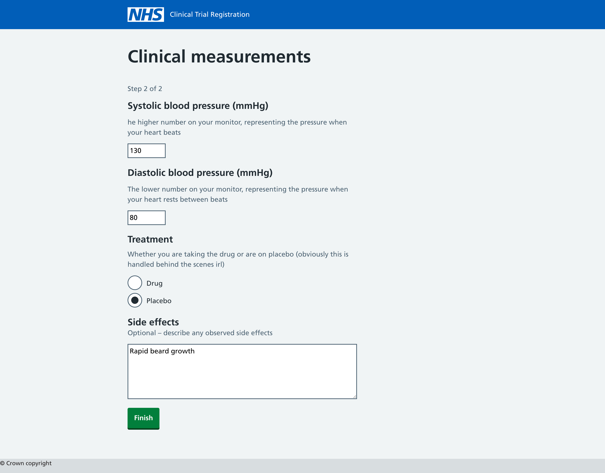
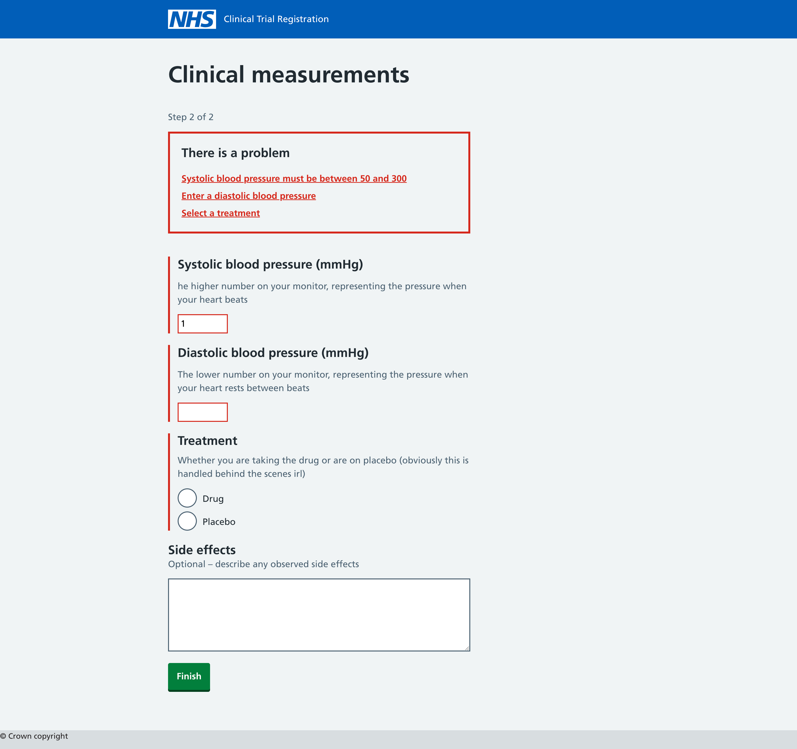
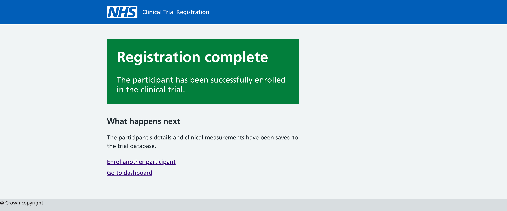
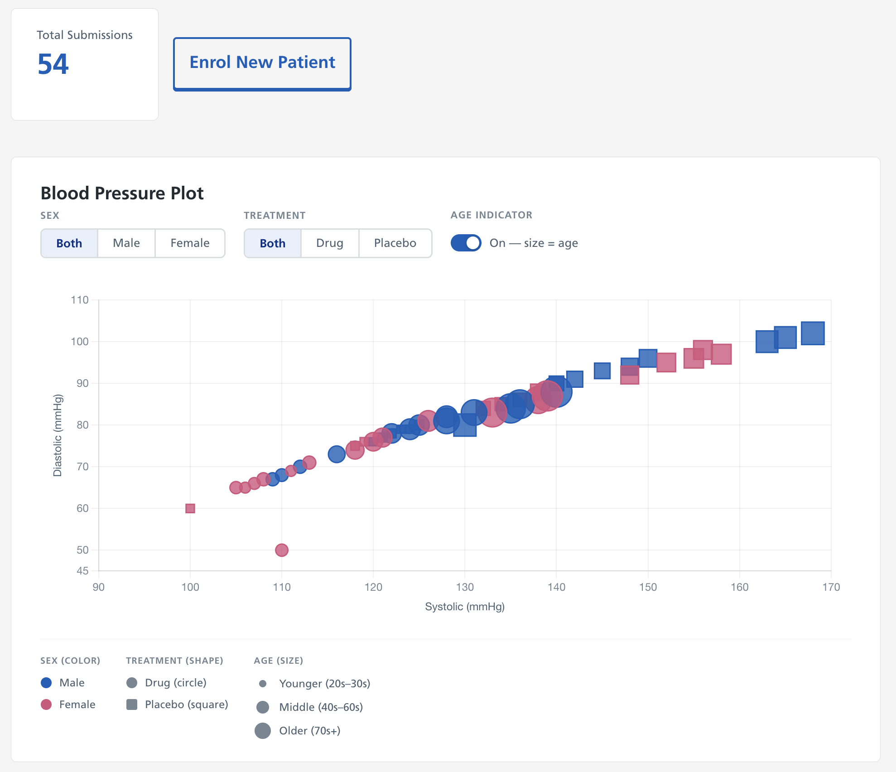
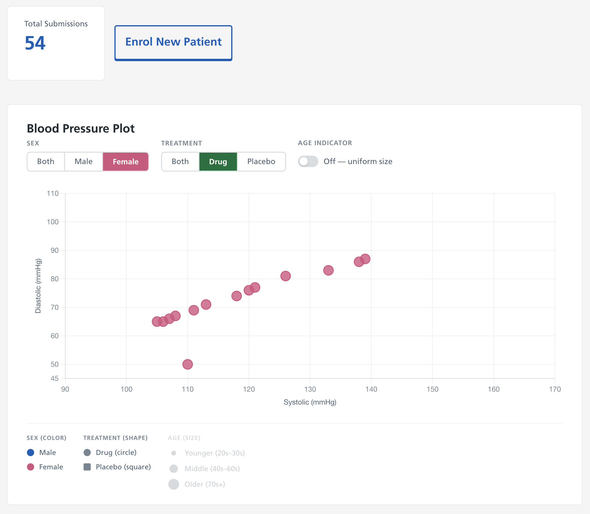
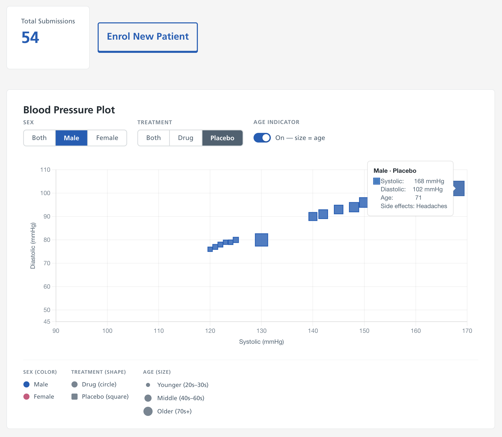

# NHS Clinical Trial Registration (Kotlin)

A Kotlin/Ktor port of the [NHS Clinical Trial Registration](https://github.com/damianflannery/nhs-trial-app) app for enrolling participants into a clinical trial.  
Built with Ktor, HTMX, PostgreSQL, Exposed ORM, and Flyway; styled with the [NHS Design System v9](https://service-manual.nhs.uk/design-system).

---

## Architecture overview

```
browser ──HTMX──► Ktor / Netty
                      │
                      ├── PersonRoutes   (/person)    – step 1: collects personal details
                      ├── MedicalRoutes  (/medical)   – step 2: collects clinical data, saves both records
                      ├── DashboardRoutes (/dashboard) – scatter-plot dashboard with filters
                      └── configureDatabase()          – HikariCP pool + Flyway migrations on startup
                                │
                                └── PostgreSQL (via Exposed ORM + HikariCP)
```

The two-step form stores the person data server-side in a `SessionStorageMemory` session.  
**No data is written to the database until the user clicks Finish on step 2.**

HTMX is used for progressive enhancement: forms POST via AJAX and return either an `HX-Redirect` header on success or a partial HTML fragment on validation failure — no full-page reloads needed.

---

## Privacy note

NHS numbers are [personally identifiable information (PII)](https://digital.nhs.uk/data-and-information/looking-after-information/data-security-and-information-governance/codes-of-practice-for-handling-information-in-health-and-care/code-of-practice-on-confidential-information).  
This application deliberately:

- Excludes NHS numbers from all log output (see `Person.toString()`).
- Never logs raw form parameters that may contain NHS numbers.
- Stores the session server-side (`SessionStorageMemory`) so NHS numbers never appear in a client cookie.
- Stores NHS numbers only in the database, which should itself be encrypted at rest in production.

Do **not** add NHS numbers to log statements when extending this application.

---

## Tech stack

| Concern | Technology |
|---|---|
| Language | Kotlin 2.1.0 |
| Runtime | Ktor 3.0.3 (Netty engine), JVM 21 |
| Database | PostgreSQL 16, Exposed ORM 0.53.0, HikariCP 5, Flyway 10 |
| UI | kotlinx.html DSL, HTMX 2.0.3, NHS Design System v9, Chart.js 4 |
| Build | Gradle 8.11.1, Shadow plugin (fat JAR) |
| NHS assets | node-gradle plugin, nhsuk-frontend npm package |
| Unit/route tests | Ktor `testApplication`, JUnit 5, Jsoup |
| E2E | Playwright (TypeScript) |
| CI | GitHub Actions |
| Containers | Docker, Docker Compose |

---

## Development setup

### Prerequisites

- Java 21+
- Docker Desktop (for the PostgreSQL dev database)
- IntelliJ IDEA (recommended)

Node.js is **not** required locally — Gradle downloads it automatically via the node-gradle plugin when building.

### Clone and start the database

```bash
git clone https://github.com/damianflannery/nhs-trial-app-kotlin.git
cd nhs-trial-app-kotlin

# Start PostgreSQL on port 5435
docker compose -f docker-compose.dev.yml up -d
```

### Environment variables

Copy `.env.example` to `.env` and adjust if needed:

```bash
cp .env.example .env
```

```
DATABASE_URL=jdbc:postgresql://localhost:5435/nhstrial
DATABASE_USERNAME=nhstrial
DATABASE_PASSWORD=nhstrial
PORT=8080
```

Flyway runs automatically on startup and creates the tables.

### Run the application

```bash
./gradlew run
```

The app is available at [http://localhost:8080](http://localhost:8080).

### IntelliJ run configuration

1. Open the project (`File → Open` → select the project directory).
2. Ensure **Project SDK** is set to Java 21 (`File → Project Structure → Project`).
3. Create an **Application** run configuration:
   - **Main class**: `io.ktor.server.netty.EngineMain`
   - **Environment variables**: paste the contents of your `.env` file
4. Run it.

### Seed demo data (optional)

To populate the dashboard with 20 realistic participants:

```bash
psql $DATABASE_URL -f src/main/resources/db/seed-demo-data.sql
```

---

## Running tests

### Unit and route tests

No database required — route tests use in-memory fakes (`FakePersonRepository`, `FakeTrialService`).

```bash
./gradlew test
```

Test reports are written to `build/reports/tests/`.

### E2E tests (Playwright)

Requires the full application stack running via Docker Compose.

```bash
# 1. Build the fat JAR
./gradlew shadowJar

# 2. Start the app + database stack
docker compose -f docker-compose.e2e.yml up -d

# 3. Install Playwright browsers (first time only)
cd e2e && npm ci && npx playwright install chromium

# 4. Run the E2E tests
npx playwright test

# 5. Tear down
docker compose -f docker-compose.e2e.yml down -v
```

To run against an already-running local server:

```bash
APP_URL=http://localhost:8080 npx playwright test
```

---

## CI pipeline (GitHub Actions)

Triggered on every push to `main` and on pull requests.

| Job | What it does |
|---|---|
| `test` | Runs all unit and route tests via `./gradlew test` (no database needed — fakes are used) |
| `e2e` | Builds the JAR and Docker image, starts the stack, runs Playwright against it |

The E2E job depends on the `test` job passing first.

---

## Project structure

```
src/
  main/
    kotlin/com/nhstrial/
      Application.kt                  – entry point, wires plugins
      html/
        Layout.kt                     – shared nhsPage() template (header, footer, HTMX)
        Components.kt                 – NHS Design System component helpers (nhsTextInput, nhsRadios …)
        PersonHtml.kt                 – participant details form
        MedicalHtml.kt                – clinical measurements form
        DashboardHtml.kt              – scatter-plot dashboard with filter controls
      model/
        Person.kt                     – Person, PersonSessionData (NHS number NOT in toString), TrialSummary
        Medical.kt                    – Medical
      plugins/
        Database.kt                   – HikariCP + Flyway + Exposed setup
        Routing.kt                    – top-level route wiring
        Sessions.kt                   – server-side session with JSON serializer
        StatusPages.kt                – 404 / 500 error pages
      repository/
        PersonRepository.kt           – Exposed DSL queries for person + trial join
        MedicalRepository.kt          – Exposed DSL insert for medical
      routes/
        PersonRoutes.kt               – HTMX-aware step-1 handler
        MedicalRoutes.kt              – HTMX-aware step-2 handler
        DashboardRoutes.kt            – dashboard page + chart-data endpoint
        ThankYouRoute.kt              – confirmation page
      service/
        TrialService.kt               – atomic save of person + medical in one transaction
      table/
        PersonTable.kt                – Exposed table definition
        MedicalTable.kt               – Exposed table definition
      validation/
        PersonValidator.kt            – NHS number (10 digits), DOB ≥18, email, gender
        MedicalValidator.kt           – BP range 50–300, treatment (Drug/Placebo)
        ValidationResult.kt           – collects field → message errors
    resources/
      application.conf                – Ktor / database config (HOCON)
      logback.xml
      db/migration/
        V1__init.sql                  – person + medical tables
        V2__add_constraints.sql       – CHECK constraints + narrowed column types
        V3__medical_fk_cascade_delete.sql – ON DELETE CASCADE on medical.person_id
      db/
        seed-demo-data.sql            – 20 synthetic participants for local dev
  test/
    kotlin/com/nhstrial/
      TestHelpers.kt                  – FakePersonRepository, FakeTrialService, testModule()
      routes/
        PersonRouteTest.kt
        MedicalRouteTest.kt
      validation/
        PersonValidatorTest.kt
        MedicalValidatorTest.kt
e2e/
  playwright.config.ts
  tests/
    enrolment.spec.ts
    dashboard.spec.ts
scripts/
  copy-assets.js                      – copies nhsuk-frontend dist into static resources
Dockerfile                            – three-stage build (node → jdk → jre)
docker-compose.dev.yml                – PostgreSQL on port 5435 for local development
docker-compose.e2e.yml                – full stack for E2E tests
.github/workflows/ci.yml
.env.example
```

---

## Screenshots

### Participant details form


### Participant details — validation errors


### Participant details — duplicate NHS number check


### Clinical measurements form


### Clinical measurements — validation errors


### Thank you page


### Dashboard — all participants


### Dashboard — Female, Drug, age indicator off


### Dashboard — Male, Placebo, age indicator on

